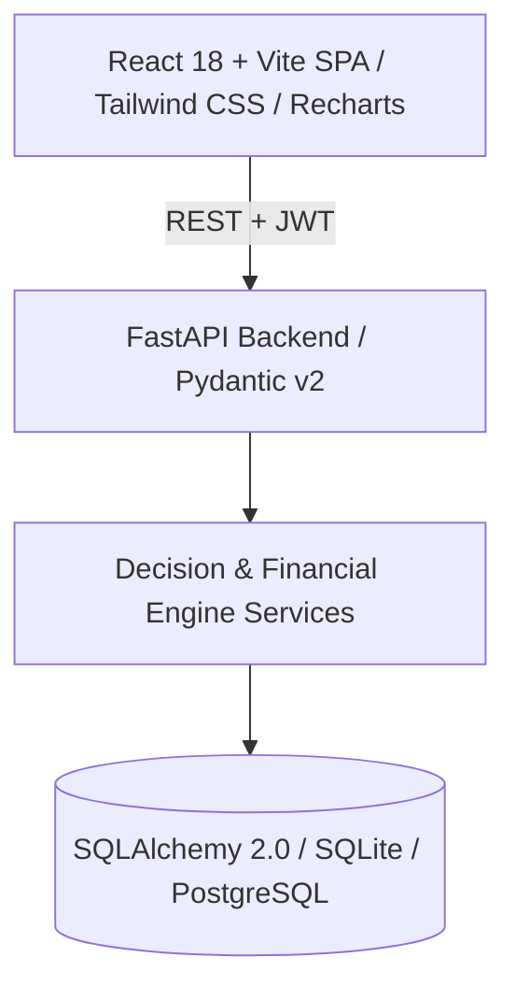

# 🎓 SpendWise — Smart College Student Finance Manager

> **A production-ready full-stack personal finance and decision-support platform designed specifically for college students.**

SpendWise transforms college budgeting from passive record-keeping into active **decision-support**. It accounts for real student realities—such as variable family allowances, mess fees, hostel rent, canteen snacks, exam fees, and part-time income—to compute live **flexible spending limits**, evaluate **purchase affordability**, project **spending burn rate**, simulate **what-if budget scenarios**, and score financial discipline with an explainable **Budget Health Score (0–100)**.

---

## 🌟 Key Features

### 🧠 4 Advanced Decision-Support Intelligence Tools

1. **"Can I Afford This?" Decision Engine (`POST /api/finance/affordability-check`)**
   - Evaluates prospective purchases in real time against flexible buffer, planned bills, and savings milestones.
   - Outputs deterministic status: 🟢 **Affordable**, 🟡 **Caution**, or 🔴 **Not Recommended** with actionable reasoning and weekly limit delta.

2. **Spending Pace & Burn Rate Intelligence (`GET /api/analytics/spending-pace`)**
   - Compares `% of flexible budget consumed` against `% of calendar month elapsed`.
   - Computes daily burn rate (`₹/day`) and projects month-end spending to proactively prevent mid-month deficits.

3. **What-If Budget Simulator Sandbox (`POST /api/finance/budget-simulator`)**
   - Simulates hypothetical one-off purchases or new subscriptions side-by-side with your active plan.
   - **Strict Zero-DB Mutation:** Computes live impact on flexible spending, weekly caps, and savings goals without saving real transactions.

4. **SpendWise Budget Health Score (0–100) (`GET /api/analytics/budget-health`)**
   - Explainable rating based on 5 weighted pillars:
     - **Budget Adherence (30%)**
     - **Savings Consistency (25%)**
     - **Spending Pace (20%)**
     - **Category Overspending Control (15%)**
     - **Recurring Expense Load (10%)**
   - Provides concrete positive and negative contributing factors.

---

### 💳 Core Financial Management

- **Student Income & Allowance Tracker:** Log allowances, part-time jobs, scholarships, and freelance gigs.
- **2-Click Quick Expense Entry:** Rapid logging with pre-built student amount chips and category shortcuts.
- **Smart Category Budgets:** Monthly category limits with automated threshold alerts (Normal, Approaching 70%, Near Limit 90%, Exceeded).
- **Recurring Commitments & Amortization:** Track Netflix, Spotify, gym fees, room rent, and mess dues with monthly amortized deductions.
- **Savings Milestones:** Goal tracker calculating recommended monthly saving pace based on target deadlines.
- **Bank / UPI Statement CSV Importer:** 5-step wizard with automatic header detection, column mapping, dry-run validation, and batch persistence.
- **Visual Analytics:** Interactive Recharts visualizations including Category Donut, 6-Month Income vs Expense Trends, Fixed vs Variable Splits, and Daily Spending Timelines.

---

## 📐 Mathematical Financial Formulas

```text
1. Recurring Monthly Allocation:
   - Weekly:        Amount × 4.333
   - Monthly:       Amount × 1.0
   - Quarterly:     Amount / 3.0
   - Semi-Annually: Amount / 6.0
   - Annually:      Amount / 12.0

2. Monthly Flexible Spending:
   Flexible = Total Income - Planned Recurring Allocations - Monthly Savings Target - Total Spent

3. Safe Spending Limits:
   - Safe Weekly Limit = Max(0, Flexible Spending) / 4.33
   - Safe Daily Limit  = Max(0, Flexible Spending) / Remaining Days in Month

4. Spending Pace & Burn Rate:
   - Daily Burn Rate = Total Spent / Days Elapsed
   - Projected Month-End Spend = Daily Burn Rate × Total Days in Month

5. Budget Health Score (0–100):
   Score = (0.30 × Adherence) + (0.25 × Savings) + (0.20 × Pace) + (0.15 × CategoryControl) + (0.10 × RecurringLoad)
```

---

## 🛠️ Architecture & Tech Stack



| Layer | Technologies |
|---|---|
| **Frontend** | React 18, TypeScript, Vite, Tailwind CSS, Recharts, Lucide Icons, Axios |
| **Backend** | Python 3.11+, FastAPI, Pydantic v2, SQLAlchemy 2.0, Python-Jose (JWT), Bcrypt |
| **Database** | SQLite (Default for zero-setup local dev) / PostgreSQL supported |
| **Testing** | Pytest, In-Memory SQLite Test Suite (16 passing tests) |
| **DevOps** | Docker, Docker Compose, Nginx Multi-stage containerization |

---

## 🚀 Getting Started

### Prerequisites
- **Python 3.10+**
- **Node.js 18+** and **npm**

---

### 1. Backend Setup

```bash
cd backend

# Create virtual environment
python -m venv venv

# Activate virtual environment
# Windows:
venv\Scripts\activate
# macOS/Linux:
source venv/bin/activate

# Install dependencies
pip install -r requirements.txt

# Start FastAPI development server
uvicorn app.main:app --reload --host 127.0.0.1 --port 8000
```
API Documentation will be live at `http://127.0.0.1:8000/docs`.

---

### 2. Frontend Setup

```bash
cd frontend

# Install packages
npm install

# Start Vite dev server
npm run dev
```
The application will open at `http://localhost:5173`.

---

### 3. Running with Docker Compose

To start both the Backend and Frontend with a single command:

```bash
docker-compose up --build
```
- Frontend: `http://localhost`
- Backend API: `http://localhost:8000/api`
- API Docs: `http://localhost:8000/docs`

---

## 🧪 Running Automated Tests

SpendWise includes comprehensive automated test coverage for authentication, financial formulas, affordability rules, simulations, and CSV validation:

```bash
cd backend
pytest -v
```

**Results:**
```text
tests/test_auth.py::test_register_user PASSED
tests/test_auth.py::test_login_user PASSED
tests/test_expenses.py::test_create_expense PASSED
tests/test_expenses.py::test_get_expenses_with_filters PASSED
tests/test_income.py::test_create_income PASSED
tests/test_income.py::test_income_summary PASSED
tests/test_budgets.py::test_set_budget PASSED
tests/test_budgets.py::test_budget_progress PASSED
tests/test_recurring.py::test_create_recurring_expense PASSED
tests/test_savings.py::test_savings_goal_workflow PASSED
tests/test_decision_support.py::test_affordability_check_affordable PASSED
tests/test_decision_support.py::test_affordability_check_not_recommended PASSED
tests/test_decision_support.py::test_spending_pace_calculation PASSED
tests/test_decision_support.py::test_budget_simulator_no_db_mutation PASSED
tests/test_decision_support.py::test_budget_health_score PASSED
tests/test_csv_import.py::test_csv_validation_report PASSED

======================== 16 passed in 7.94s ========================
```

---

## 📁 Project Directory Structure

```text
SpendWise/
├── backend/
│   ├── app/
│   │   ├── core/           # Security, JWT tokens, Settings
│   │   ├── database/       # SQLAlchemy engine & session
│   │   ├── models/         # User, Expense, Income, Budget, Recurring, Savings, Category
│   │   ├── schemas/        # Request & Response Pydantic v2 schemas
│   │   ├── services/       # Financial engine, Affordability, Health score, Simulator
│   │   ├── routes/         # FastAPI API endpoints
│   │   └── main.py         # Application entry point
│   ├── tests/              # Pytest automated test suite
│   ├── Dockerfile
│   └── requirements.txt
├── frontend/
│   ├── src/
│   │   ├── components/
│   │   │   ├── common/     # UI primitives (Card, Button, Modal, Badge, Toast)
│   │   │   ├── layout/     # Sidebar, Navbar, MobileNav, AppLayout
│   │   │   ├── dashboard/  # Charts, Widgets, KPI cards, Quick Add
│   │   │   ├── decision/   # Affordability, Simulator, Health, Burn rate
│   │   │   ├── expenses/   # Table, Filters, Modals
│   │   │   ├── income/     # Table, Summary
│   │   │   ├── budgets/    # Grid, Modals
│   │   │   ├── recurring/  # List, Amortization
│   │   │   ├── savings/    # Goals, Deposits
│   │   │   └── csv/        # 5-step CSV import wizard
│   │   ├── context/        # AuthContext
│   │   ├── pages/          # Full-page views
│   │   ├── services/       # Typed Axios API client
│   │   └── types/          # TypeScript interfaces
│   ├── Dockerfile
│   ├── nginx.conf
│   └── package.json
├── docker-compose.yml
├── .env.example
├── .gitignore
└── README.md
```

---

## 🔒 Security & Privacy

- Passwords hashed using salted `bcrypt`.
- Stateless authentication using signed `HMAC-SHA256` JWT bearer tokens.
- Complete per-user data isolation on every endpoint.
- CORS restricted to configured frontend domains.
- All values user-configurable without hardcoding personal data.

---

## 📄 License
MIT License. Built for students worldwide. 🎓
